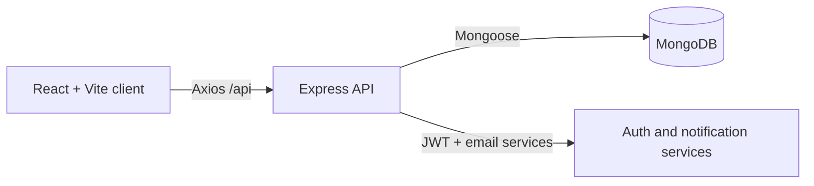

# AhaduCenter

AhaduCenter - Movies, Books & Electronics in one premium platform.

  [](LICENSE)  

**Live demo:** [ahadu-center.vercel.app](https://ahadu-center.vercel.app/)

AhaduCenter is a multi-domain platform for Ahadu Center, a cultural and commercial hub in Addis Ababa, Ethiopia. It combines a movie catalog, a book library, and an electronics catalog in one React and Node.js application. Members can discover content, borrow or reserve books, request movies, maintain wishlists, receive notifications, and place electronics pickup orders. Administrators manage catalog content, requests, and contact submissions.

## Contents

- [Features](#features)
- [Architecture](#architecture)
- [Technology](#technology)
- [Project structure](#project-structure)
- [Quick start](#quick-start)
- [Environment](#environment)
- [Tests](#tests)
- [API overview](#api-overview)
- [Contributing](#contributing)
- [TODO](#todo)

## Features

- **Movie Center:** browse and filter movies, read reviews, and submit movie requests.
- **Book Center:** search books, borrow, reserve, renew, return, review, and view borrowing history.
- **Electronics Hub:** browse products, compare products, manage a wishlist, and place pickup orders.
- **Authentication:** email-based registration and verification, Google sign-in support, JWT bearer authentication, password recovery, and `user`/`admin` roles.
- **Personal tools:** wishlist, notifications, account activity, purchase history, and unified search.
- **Administration:** dashboard statistics, recent activity, catalog CRUD, movie-request status updates, contact moderation, and image uploads.

The implemented role enum is `user` and `admin`; a separate `staff` role is not currently defined.

## Architecture



The client resolves `VITE_API_URL` first and falls back to `VITE_API_BASE_URL`. Axios sends JSON requests and attaches the local JWT as a bearer token. Express validates requests, controllers call services/models, and Mongoose persists data in MongoDB.

## Technology

| Layer | Implementation |
| --- | --- |
| Frontend | React 18, TypeScript, Vite, React Router 6, Redux Toolkit, Tailwind CSS |
| Backend | Node.js, Express 4, Mongoose 8 |
| Database | MongoDB |
| Authentication | JSON Web Tokens, bcryptjs, Google Identity Services support |
| Testing | Vitest, Testing Library, Jest, Supertest, fast-check, mongodb-memory-server |
| Operations | Docker Compose, Dockerfiles, npm scripts, and nginx configuration for the client |

## Project structure

```text
client/                 React application, pages, components, Redux, services, tests
server/                 Express application, controllers, models, routes, seeders, tests
uploads/                Server-side uploaded files served at /uploads
package.json files      npm scripts for installing, running, testing, and seeding
docker-compose.yml      Docker services for MongoDB, the API, and the client
```

See the detailed [client README](client/README.md) and [server README](server/README.md).

## Quick start

### Option 1: Docker Compose

Prerequisites: Docker Desktop or Docker Engine with Docker Compose.

```bash
git clone https://github.com/Abrham-Asrat/ahaduCenter.git
cd ahaduCenter
cp server/.env.example server/.env
# Edit server/.env and set JWT_SECRET before starting the containers.
docker compose up --build
```

Open `http://localhost`. Docker starts MongoDB, the API, and the client together. The API is also available at `http://localhost:5000`.

Stop the services with:

```bash
docker compose down
```

### Option 2: Node.js directly

Prerequisites: Node.js 18 or newer, npm, and a reachable MongoDB instance.

```bash
cd server
npm install
cp .env.example .env
# Edit .env with a real JWT_SECRET and MongoDB connection string.
npm run dev
```

In a second terminal:

```bash
cd client
npm install
cp .env.example .env
npm run dev
```

Open `http://localhost:5173`. The server startup requires `PORT`, `MONGO_URI`, `JWT_SECRET`, `CLIENT_ORIGIN`, and `CLIENT_URL`. To load development data, stop the server if necessary and run `npm run seed` from `server`; see the seed warning in the [server README](server/README.md).

## Environment

| Variable | Location | Description | Example |
| --- | --- | --- | --- |
| `VITE_API_BASE_URL` | `client/.env` | API base URL fallback | `http://localhost:5000/api` |
| `VITE_API_URL` | `client/.env` | API base URL used first when set | `http://localhost:5000/api` |
| `VITE_GOOGLE_CLIENT_ID` | `client/.env` | Google sign-in client ID | `...apps.googleusercontent.com` |
| `PORT` | `server/.env` | HTTP port; startup requires it | `5000` |
| `MONGO_URI` | `server/.env` | MongoDB connection URI; startup requires it | `mongodb://localhost:27017/ahadu_center` |
| `JWT_SECRET` | `server/.env` | JWT signing secret; startup requires it | `<strong-secret>` |
| `CLIENT_ORIGIN` | `server/.env` | Comma-separated allowed CORS origins | `http://localhost:5173` |
| `CLIENT_URL` | `server/.env` | Frontend URL used in email links | `http://localhost:5173` |
| `OVERDUE_FEE_PER_DAY`, `RESERVATION_FEE` | `server/.env` | Library fee settings | `1`, `50` |
| `EMAIL_HOST`, `EMAIL_PORT`, `EMAIL_USER`, `EMAIL_PASS`, `EMAIL_FROM` | `server/.env` | Nodemailer configuration | `smtp.mailtrap.io` |
| `GOOGLE_CLIENT_ID` | `server/.env` | Google auth client ID | `...apps.googleusercontent.com` |
| `MONGO_SEED_URI` | `server/.env` | Optional seed-only URI override | `mongodb://localhost:27017/ahadu_seed` |

## Tests

```bash
cd client && npm test
cd client && npm run test:watch
cd server && npm test
```

Client coverage is available through the installed `@vitest/coverage-v8` package, but no `test:coverage` script is defined. Run `npx vitest --coverage` from `client` when coverage is needed.

## API overview

| Domain | Base path | Description |
| --- | --- | --- |
| Auth and users | `/api/auth`, `/api/users` | Registration, login, profile, wishlist, notifications |
| Books and borrowing | `/api/books`, `/api/borrowings` | Catalog, reviews, borrowing, reservations, renewal, return |
| Movies | `/api/movies`, `/api/movie-requests` | Catalog, reviews, and requests |
| Electronics and orders | `/api/products`, `/api/orders` | Catalog and pickup orders |
| Search and contact | `/api/search`, `/api/contact` | Unified search and contact form |
| Administration | `/api/admin`, `/api/uploads` | Admin dashboard, CRUD, moderation, uploads |

See the complete endpoint reference in [server/README.md](server/README.md).

## Contributing

1. Create a focused branch such as `feat/book-reservations` or `fix/api-auth`.
2. Use Conventional Commits, for example `feat: add book renewal flow`.
3. Run the relevant client and server tests, lint, and type check.
4. Open a PR with a concise description, test evidence, screenshots for UI changes, and notes about environment changes.

## License

This project is licensed under the [MIT License](LICENSE).

## Author and contact

| Field | Value |
| --- | --- |
| Author | Abrham Asrat |
| Email | abrishasrat12@gmail.com |
| GitHub | https://github.com/Abrham-Asrat/ahaduCenter |

## TODO

- Add CI-backed build and test badges when a workflow is published.
- Add product screenshots or short workflow GIFs.
- Decide whether to add `CONTRIBUTING.md`, `CODE_OF_CONDUCT.md`, `SECURITY.md`, and `CHANGELOG.md`.